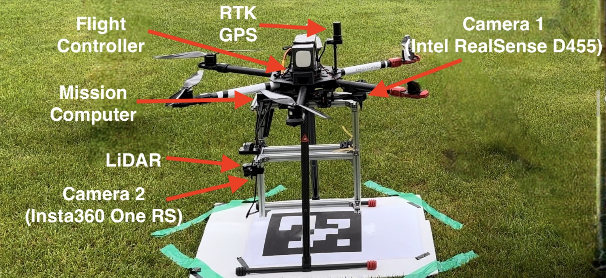

# 2023 koreauav Khadas VIM4 main-repo
**Author: Jusuk Lee, ChanJoon Park, Hokyun Im, Inha Baek**

### Hardware Setup
|  |  |
|:--:|:--:|
|**S500 Test Frame**|**T810 Main Frame**|
- **Flight Controller**: Pixhawk FC 6X
- **Onboard Computer**: Khadas VIM4
- **Camera**: Intel RealSense D455 Depth Camera
- **Positioning System**: Holybro H-RTK F9P GPS + Garmin LiDAR-Lite v3

### Usage
```bash
roslaunch offboard avoidance.launch # or avoidance_uart.launch
roslaunch offboard waypoint_server.launch
roslaunch mission.launch # OFFBAORD!
rosrun koreauav_utils flight_csv.py # Record a flight log
```

### Project Tree
```
📦building_search
 ┣ 📂include
 ┃ ┗ 📂building_search
 ┃ ┃ ┗ 📜building_search.hpp
 ┣ 📂scripts
 ┃ ┗ 📜building_search_python_node.py
 ┣ 📂src
 ┃ ┣ 📜building_search.cpp
 ┃ ┗ 📜building_search_node.cpp
📦isly
 ┣ 📂scripts
 ┃ ┗ 📜isly_path_node.py
📦offboard
 ┣ 📂launch
 ┃ ┣ 📜avoidance.launch
 ┃ ┣ 📜avoidance_eth.launch
 ┃ ┣ 📜avoidance_uart.launch
 ┃ ┣ 📜mission.launch
 ┃ ┗ 📜waypoint_server.launch
 ┣ 📂scripts
 ┃ ┣ 📜control_node.py
 ┃ ┣ 📜path_node.py
 ┃ ┗ 📜setmode_node.py
 ┣ 📂src
 ┃ ┗ 📜mission_controller.cpp
📦safety_landing
 ┣ 📂scripts
 ┃ ┣ 📜PID_control_node.py
 ┃ ┣ 📜RL_aruco_control_node.py
 ┃ ┗ 📜aruco_VIO.py
📦utils
 ┣ 📂config
 ┃ ┗ 📜gps_coordinates.yaml
 ┣ 📂launch
 ┃ ┣ 📜gps_to_enu.launch
 ┃ ┗ 📜yaml_to_gps.launch
 ┣ 📂scripts
 ┃ ┣ 📜cargo_launch.py
 ┃ ┣ 📜flight_csv.py
 ┃ ┣ 📜flight_csv_reader.py
 ┃ ┣ 📜flight_csv_rmse.py
 ┃ ┗ 📜yonsei_drone_flight.csv
 ┣ 📂src
 ┃ ┣ 📂koreauav_utils
 ┃ ┃ ┣ 📜__init__.py
 ┃ ┃ ┗ 📜auto_service.py
 ┃ ┗ 📜yaml_to_gps.cpp
📦yolo_cross_detection
 ┣ 📂launch
 ┣ 📂scripts
 ┃ ┣ 📜image_recorder.py
 ┃ ┣ 📜npy_visualizer.py
 ┃ ┣ 📜yolo_tf_node.py
 ┃ ┗ 📜yolo_utils.py
 ┣ 📂weight
 ┃ ┣ 📜yolov5nV4.onnx
 ┃ ┗ 📜yolov5nV4.pt
📦ysdrone_msgs
 ┣ 📂srv
 ┃ ┗ 📜DroneCommand.srv
```

### Documentation

- [Offboard](./offboard/README.md)
- [Building Search](./building_search/README.md)
- [Marker Approach](./yolo_cross_detection/README.md)
- [I Still Love You](./isly/README.md)
- [Safety Landing](./safety_landing/README.md)
- [Utils](./utils/README.md)
- [Drone Command](./ysdrone_msgs/README.md)

For more information and details, visit [YonseiDrone Notion Project Page](https://www.notion.so/yonseidrone/EMBARGOED-3-846677f5383842c79134588fdd9a5aba?pvs=4)